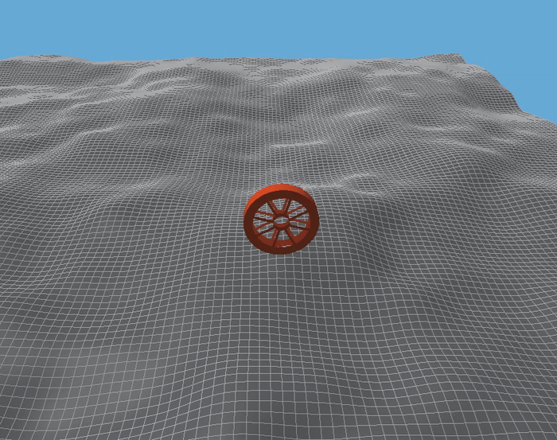
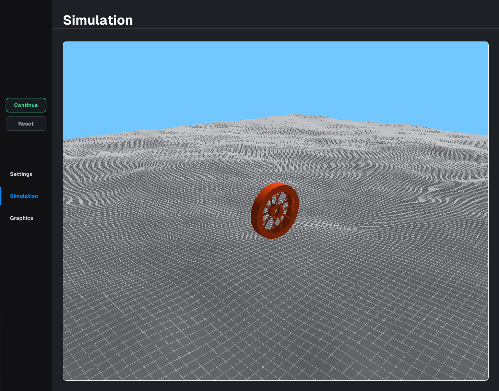
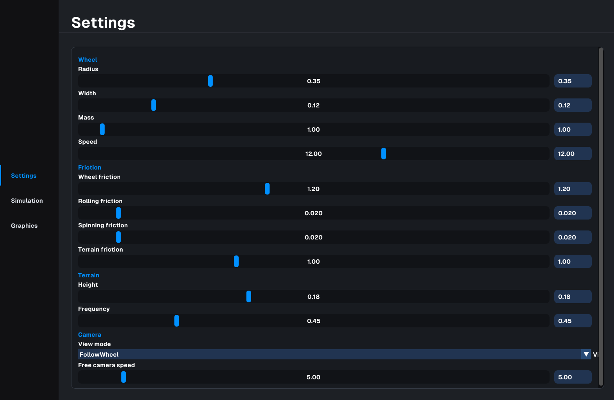
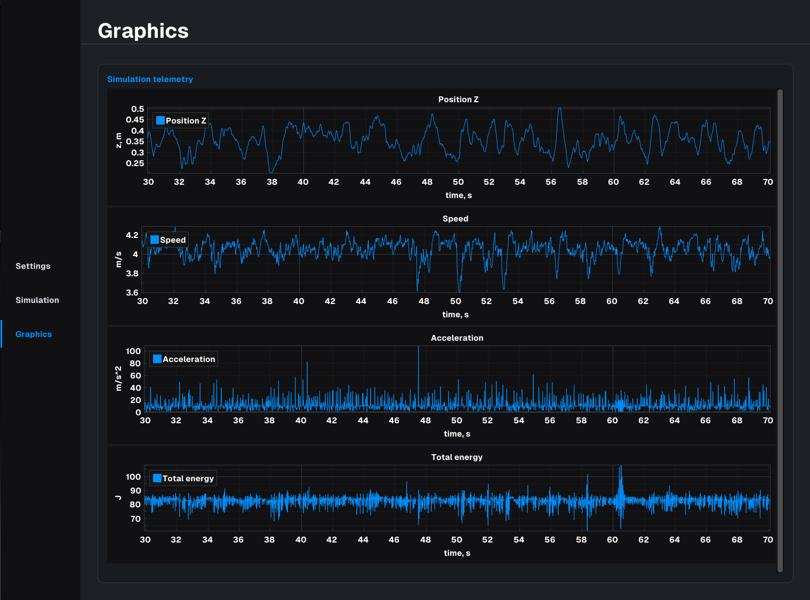

# Wheel Simulator

<p align="center">
  
</p>

**Wheel Simulator** — C++ приложение для симуляции движения колеса по неровной поверхности.

Проект использует **Bullet Physics** для расчёта физики и **OpenGL** для визуализации сцены. Интерфейс сделан на **Dear ImGui**: в нём можно запускать и останавливать симуляцию, менять параметры колеса, terrain и камеры, а также смотреть графики телеметрии.

## Возможности

- физическая симуляция колеса через Bullet;
- генерация неровной поверхности на основе heightfield;
- динамическое обновление terrain вокруг колеса;
- визуализация сцены через OpenGL;
- отдельные GLSL-шейдеры для рендера;
- отображение симуляции внутри ImGui-интерфейса;
- режимы камеры:
  - `FollowWheel`;
  - `Free`;
- настройка параметров колеса, трения, terrain и камеры;
- отображение графиков:
  - высота колеса;
  - скорость;
  - ускорение;
  - полная энергия;
- горячие клавиши для управления интерфейсом и симуляцией.

## Сборка

**Wheel Simulator** требует компилятор с поддержкой **C++17**.

Основной способ сборки проекта — через **Conan** и **CMake**.

Поддерживаемые варианты сборки:

- **conan** — основной вариант для Linux/Windows;
- **straight cmake** — если все зависимости установлены вручную.

### Сборка через Conan

> [!NOTE]
> Для сборки через Conan нужен **CMake 3.23 или новее** и **Conan 2**. <br>

> [!TIP]
> Если Conan ещё не установлен, его можно установить, например, через `pipx`:
>
> ```bash
> pipx install "conan>=2,<3"
> ```

### Linux
```bash
git clone https://github.com/dangerUser45/WheelSimulator.git
cd WheelSimulator
mkdir build

conan profile detect

conan install . -s build_type=Release -c tools.system.package_manager:mode=install --build=missing

cmake --preset conan-release

cmake --build build/Release
```

Запуск:

```bash
./build/Release/WheelSimulator
```

### Windows 
```powershell
git clone https://github.com/dangerUser45/WheelSimulator.git
cd WheelSimulator
mkdir build

conan profile detect

conan install . -s build_type=Release -c tools.system.package_manager:mode=install --build=missing

cmake --preset conan-default

cmake --build build --config Release
```

Запуск
```powershell
.\build\Release\WheelSimulator.exe
```

## Примеры работы программы






